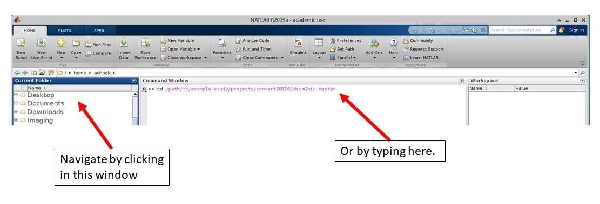

# Converting to NIfTI and BIDS
Converting anonymized DICOM files into NIfTI files and reorganizing/renaming files and folders to follow the BIDS specification.

## Background Information
### The Origins of NIfTI
DICOM images provide a means for storing and sharing a wide variety of medical images. The flexibility provided by the DICOM standard to store many types of images also makes it more difficult to write software to handle the many options available [[1]](#1). Thus, in the early days of neuroimaging there was a need for a file type that would simplify neuroimaging data storage and lower the barrier to software development.

One of the early file types to address this problem was the ANALYZE 7.5 format [[2]](#2). The format was originally developed in the late-1980s as part of a larger software suite aimed at integrating several previously independent and idiosyncratic display algorithms [[3]](#3). The ANALYZE format was designed specifically for multidimensional data (supports up to 7 dimensions)[[2]](#2)[[4]](#4) making it well suited to represent the 4-dimensional volumetric time series common in neuroimaging. It gained widespread use, however contained several critical drawbacks that made working with the file type hazardous. For example, the format splits data across two files, a header file (.hdr) and a pixel intensity file (.img). This meant that if one of the files was misplaced,the entire image became unusable.

Of some of the more troublesome problems, ANALYZE 7.5 did not explicitly encode the spatial orientation of the image. This meant that there was no explicit indication as to which part of the image was the participants' left/right, front/back, or top/bottom [[2]](#2)[[5]](#5)[[6]](#6). This turned out to be a crucial flaw of the file format as it sometimes lead to unanticipated left-right flipping of the image so that in was unclear if the experimenter was looking at the participant's left or right side of the brain<sup>[1](#footnotes),[2](#footnotes)</sup>. 

To address the shortcomings of the ANALYZE format, the U.S. National Institutes of Health sponsored a working group called the <u>N</u>euroimaging <u>I</u>n<u>f</u>ormatics <u>T</u>echnology <u>I</u>nitiative<sup>[3](#footnotes)</sup> to create a new neuroimaging data format [[7]](#7). The new format was eponymously called the NIfTI (*.nii*) format and has become the de facto standard file type for neuroimaging analysis. The first NIfTI standard (NIfTI-1) was developed in 2003 as a modified version of the original ANALYZE 7.5 file type in which unused and optional fields in the header were redefined to address the shortcomings of ANALYZE [[8]](#8). In 2011, the NIfTI committee updated the format to NIfTI-2 in which much of the backwards compatability with ANALYZE was dropped and the allowable size of imaging data expanded [[9]](#9). Currently, NIfTI-1 is still the more common file type [[10]](#10) and the default output of many neuroimaging tools, however both standards are in active use and most major software utilities have agreed to provide support for NIfTI-2 in upcoming releases [[11]](#11). 

NIfTI allows data to be stored as either a *.hdr*/*.img* file pair (originally for backwards compatability with non-NIfTI aware software) or as a single *.nii* file [[8]](#8)[[9]](#9). Similar to ANALYZE, NIfTI files can store a series of brain images either as multiple files each containing a single 3D brain volume, or as a single large file in which time is represented along a fourth dimension. The BIDS specification (discussed below) additionally recommends compressing NIfTI files using gzip (thus files with the *.nii.gz* file extension represent one or more compressed *.nii* files<sup>[4](#footnotes)</sup>) [[12]](#12) and are an increasingly common approach to managing the large amounts of data produced by neuroimaging experiments.

### The BIDS Specification
Heterogeneity in neuroimaging file naming, folder structures, and data organization can create difficulties for the long-term usability of often expensive and hard to acquire data. It can mean that complex data requires time-consuming reorganization to be usable in existing analysis pipelines expecting an alternate organization. It also poses the risk of knowledge loss when the person who collected/organized the data is no longer available to provide (or no longer remembers!) answers to questions about ambiguously or confusingly documented data. In general, the lack of a consensus around how to structure neuroimaging data can impede rapid dissemination and analysis, lead to time wasted on repeated data curation tasks, and risk the long-term integrity of valuable brain imaging data. 

The <u>B</u>rain <u>I</u>maging <u>D</u>ata <u>S</u>tructure (BIDS) specification was created as a method of organizing brain imaging data according to a set of common principles and conventions. It was first described in 2016 and produced to address the common problem of idiosyncratic data organization and documentation [[13]](#13).  Although there had been several attempts before to create a data structure specification, none had acheived widespread adoption [[13]](#13). The BIDS specification however was created by the same research group that developed OpenNeuro (originally called OpenfMRI [[14]](#14)) [[15]](#15), and it is perhaps unsurprising that it was adopted as the organizational standard of the platform. OpenNeuro has become a convenient and popular service for disseminating neuroimaging datasets, helping to pave the way for BIDS to emerge as the new standard for data organization.

BIDS supports a number of different data modalaties (*e.g.* functional and structural MRI, EEG, MEG, Genetic Information *etc.*) and there are a number of actively developing proposals to extend BIDS to support the curation of additional types of information [[16]](#16). Currently, BIDS benefits from an active community driven development model [[16]](#16) and a diverse ecosystem of BIDS-aware analysis pipelines [[17]](#17).

**[https://bids-specification.readthedocs.io/en/stable](https://bids-specification.readthedocs.io/en/stable) defines the BIDS specification and we highly recommend users familiarize themselves with this resource before continuing in the conversion process.**


### Footnotes
1. *Note that imaging facilities may use fiducial markers to reduce the potential for left-right errors. These markers, such as a vitamin E capsule taped to one side of the head, will display as a bright mark in the image. It is good practice to be aware of your imaging center's policy for fiduciary marking and to document any marker placement used for your data.*

2. *For a more in-depth discussion of how voxels (*i.e.* volumetric pixels) are mapped onto real-world coordinate systems, take a look at the writings provided by Graham Wideman and Nibabel:*

   + *Orientation and voxel-order terminology ([LINK](www.grahamwideman.com/gw/brain/orientation/orientterms.htm)).*
   + *Coordinate systems and affines ([LINK](https://nipy.org/nibabel/coordinate_systems.html))*
   + *Radiological vs neurological conventions ([LINK](https://nipy.org/neuro_radio_conventions.html))*

3. *The details of the NIfTI format were produced by the Data Format Working Group, existing within the larger NIfTI organizational body [[7]](#7).*

4. *Although some neuroimaging tools support working directly with gzipped NIfTI, others do not and files must be unzipped prior to use.*

## Software Setup
### MATLAB
[MATLAB](https://www.mathworks.com/products/matlab.html) is needed to run the dicom conversion tool described below. The conversion tool was created with MATLAB R2017a and examples here are provided with R2019a, however it is listed in the MathWorks file exchange as compatible with any MATLAB release.

We recognize that MATLAB is proprietary software and not all individuals will have access to the resources needed to acquire it. In this regard there are a number of other similar conversion tools in existence (see [https://bids.neuroimaging.io/benefits.html#converters](https://bids.neuroimaging.io/benefits.html#converters) for a list of other BIDS conversion tools). *Please consider contributing alternate instructions for this step if you have any experience with any of these other tools!*

### dicm2nii
[dicm2nii](https://github.com/xiangruili/dicm2nii) is a collection of tools used to both convert DICOM files to NIfTI and to reorganize them into a BIDS style hierarchy (as well as do some other useful tasks) [[1]](#1). Additional information will need to be added at later steps to fully bring the data into BIDS compliance, but this does a lot of the initial heavy lifting.

To use the dicm2nii tools, download the code from either the MathWorks File Exchange ([LINK](https://mathworks.com/matlabcentral/fileexchange/42997-xiangruili-dicm2nii)) or the directly from its GitHub repository ([LINK](https://github.com/xiangruili/dicm2nii) -- you can do this by clicking on the green button called *Code* >> *Download ZIP*). To use the tools, unzip them and move them to your project directory by typing in the command line:
```shell
unzip /path/to/downloaded/dicm2nii-master.zip -d /path/to/studyname/projects/convert2BIDS/
```

We recommend looking at the description provided in the top lines of the dicm2nii.m file as this provides useful information about how dicm2nii will behave. You can read it by clicking on the file listed at GitHub.

## Instructions
### Things to Know When Using dicm2nii
:warning: Before starting, be aware that the dicm2nii converter:
  + Does not care about the file hierarchy you created. Instead, it uses the DICOM header data to infer where to put and what to name generated NIfTI files.
  + dicm2nii will save a `dcmHeaders.mat` file into the ouput directory. This stores header information from the DICOMs. Much of this information however will be stored in the generated BIDS metadata and is not needed in the final BIDS structure.
  + The author of dicm2nii highly discourages converting multiple subjects at once (stated in the code comments). Here are some reasons why we agree it wouldn't be a good idea:
       1. If it finds multiple values in the 'PatientName' tag, it will attempt to sort scans into folders named with the 'PatientName', but since everyone should already be renamed to 'anonymous', all scans will be but into a single folder.
       2. When running with BIDS conversion (*i.e.* converting to *.nii* and generating metadata) dicm2nii uses the 'SeriesDescription' tag to match names created from user input (more on that below) to specific runs. If there are runs with the same series description with the same patient name, data will be quietly overwritten!
         + When converting only to *.nii* (*i.e.* not also generating BIDS metadata), the 'SeriesNumber' tag will be also be appended to try to make file names unique. Again, if this does not result in unique files names, runs will be overwritten. For participants whose scans were conducted in a standard order (as is typical in neuroimaging) it is highly likely that a given run will have the same series number across participants.
  + If your study design has 2 runs with the same 'SeriesDescription' tag -- which could possibly be the case if you had 2 scans using the same tasks, then we recommend converting data run-by-run rather than by subject to avoid unintended overwriting (see point 2 above). Remember, you can always use the DicomBrower described in the [previous step](./De-Identifying%20DICOMS.md) to verify this. We recommend using a temporary output folder and renaming files with the BIDS `run-<index>` and/or `acq-<label>` [convention](https://bids-specification.readthedocs.io/en/stable/99-appendices/09-entities.html) before moving into the new file hierarchy.

1. Create a folder called `rawdata` under the study's `data` folder. 

2. This is now where you may need to do a bit of reorganization to your file hierarchy if you are working with multi-session or multi-site studies. If you have determined that your data needs to be reorganized, read the BIDS specification for [Longitudinal and multi-site studies](https://bids-specification.readthedocs.io/en/stable/06-longitudinal-and-multi-site-studies.html) *before* proceeding.

4. To open MATLAB, open a terminal and type `matlab`. In MATLAB, navigate to the folder containing the dicm2nii tools by either *Current Folder* window or by typing `cd /path/to/studyname/projects/convert2BIDS/dicm2nii-master` in the *Command Window*.

<p align="center" width="100%">
    
</p>

2. Run the dicm2nii tool by typing `dicm2nii` in the MATLAB command window. This will open the DICOM to NIfTI converter window.

3. Select the participant's anonymized DICOM files by clicking on the *DICOM folder* button and navigating into the `anondcm` folder created previously in `/path/to/studyname/data/anondcm/`.

4. Select output directory: ~/STEP/Data/BIDS/Raw Data/

5. Check presets:
      Output format: BIDS
    Ensure the following are checked:
      Compress
      Left-had storage
      Store PatientName
      #Use parfor if needed
      Use SeriesInstanceUID if exists
      Save json file

6. Click “Start conversion”

7. Check that the following fields are correct:
  Subject: XXXXX (only five-digit participant #)
  Session: Blank
  AcquisitionDate: NaT
  Comment: Blank


  Name					                     Type		    Modality (this will be the output file name)

  AAHead_Scout_64ch_head_coil   	         skip	       
  
  t1_mprage_sag_p2_iso                    anat         T1w 
  
  fMRIFieldMap_AP                         fmap         dir-AP_run-01_epi
  
  fmriFieldMap_PA                         fmap         dir-PA_run-01_epi
  
  Block_1_SET_SBRef                       func         task-socialevaulation_run-01_sbref
  
  Block_1_SET                             func         task-socialevaulation_run-01_bold
  
  Block_1_RESTING_STATE_SBRef             func         task-resting_run-01_sbref
  
  Block_1_RESTING_STATE                   func         task-resting_run-01_bold
  
  Block1_EGNG_SBRef                       func         tasl-egonogo_run-01_sbref
  
  Block1_EGNG                             func         tasl-egonogo_run-01_bold
  
  AX                                      skip
  
  COR                                     skip

*If there are two runs of the same task, check the scan notes to see if the task was repeated. If so change "run-01" to "run-02" for the second run of the task.

7. Hit "ok" and let it run.

## Documentation
TK

## Further Reading
<a id="1">[1]</a>
Li, X., Morgan, P.S., Ashburner, J., Smith, J., & Rorden, C. (2016). The first step for neuroimaging data analysis: DICOM to NIfTI conversion. *Journal of neuroscience methods*, 264, 47-56.

<a id="2">[2]</a>
Larobina, M., & Murino, L. (2014). Medical image file formats. *Journal of digital imaging*. *27*(2), 200-206.

<a id="3">[3]</a>
Robb, R.A., Hanson, D.P., Karwoski, R.A., Larson, A.G., Workman, E.L., & Stacy, M.C. (1989). Analyze: A comprehensive, operator-interactive software package for multidimensional medical image display and analysis. *Computerized Medical Imaging and Graphics*, *13*(6), 433-454.

<a id="4">[4]</a>
Cox, B. (2019, March). *File nifti1.h -- Brief official definition of the nifti1 header*. National Institute of Mental Health. Retrieved November 23, 2021, from https://nifti.nimh.nih.gov/pub/dist/src/niftilib/nifti.h.

<a id="5">[5]</a>
Wideman, G. (2003, June 22). *Mayo/SPM "analyze" format spec compilation*. Retrieved November 27, 2021, from http://www.grahamwideman.com/gw/brain/analyze/formatdoc.htm.

<a id="6">[6]</a>
Winkler, A. M. (2012, September 23). *The NIFTI file format*. Brainder. Retrieved November 27, 2021, from https://brainder.org/2012/09/23/the-nifti-file-format/. 

<a id="7">[7]</a>
Cox, R. W., Ashburner, J., Breman, H., Fissell, K., Haselgrove, C. Holmes, C. J., Lancaster, J. L., Rex, D. E., Smith, S. M., Woodward, J. B., & Strother, S. C. (2004). *A (sort of) New Image Data Format Standard: NIFTI-1*. Retrieved November 28, 2021, from https://nifti.nimh.nih.gov/nifti-1/documentation/hbm_nifti_2004.pdf.

<a id="8">[8]</a>
Cox, B. (2003). *Breif official definition of the nifti1 header*. National Institute of Mental Health. Retrieved November 28, 2021, from https://nifti.nimh.gov/pub/dist/src/niftilib/nifti1.h

<a id="9">[9]</a>
*NIfTI-2: a 64-bit update of NIfTI1 (approved)*. NITRC. (2011, March 15). Retrieved November 28, 2021, from https://www.nitrc.org/forum/forum.php?thread_id=2148&forum_id=1941.

<a id="10">[10]</a>
NiBabel. (n.d.). *Working with NIfTI images*. Neuroimaging in Python - NiBabel 3.2.1+100.g9fdf5e3e documentation. Retrieved November 28, 2021, from https://nipy.org/nibabel/nifti_images.html.

<a id="11">[11]</a>
Reynolds, R. (2020, April 27). *NIfTI-2 Data Format - Neuroimaging Informatics Technology Initiative*. National Institute of Mental Health. Retrieved November 28, 2021, from https://nifti.nimh.nih.gov/nifti-2.

<a id="12">[12]</a>
*Common Principles -- Imaging files*. Brain Imaging Data Structure v1.6.0. (2021, April 22). Retrieved November 28, 2021, from https://bids-specification.readthedocs.io/en/stable/02-common-principles.html#imaging-files.

<a id="13">[13]</a>
Gorgolewski, K. J., Auer, T., Calhoun, V. D., Craddock, R. C., Das, S., Duff, E. P., ... & Poldrack, R. A. (2016). The brain imaging data structure, a format for organizing and describing outputs of neuroimgaing experiments. *Scientific data*, *3*(1), 1-9.

<a id="14">[14]</a>
*OpenfMRI becomes OpenNeuro*. Stanford Center for Reproducible Neuroscience RSS. (2018, February 14). Retrieved November 28, 2021, from https://reproducibility.stanford.edu/openfmri-becomes-openneuro.

<a id="15">[15]</a>
Poldrack, R. A., Barch, D. M., Mitchell, J., Wager, T., Wagner, A. D., Devlin, J. T., ... & Milham, M. (2013). Toward open sharing of task-based fMRI data: The OpenfMRI project. *Frontiers in neuroinformatics*, *7*, 12.

<a id="16">[16]</a>
*Get involved in making BIDS better*. Brain Imaging Data Structure. (2021, November 24). Retrieved November 29, 2021, from https://bids.neuroimaging.io/get_involved.html.

<a id="17">[17]</a>
Gorgolewski, C. (n.d.). BIDS Apps. Retrieved November 29, 2021, from http://bids-apps.neuroimaging.io.
