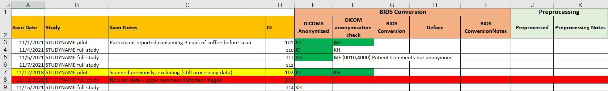

# DICOM Anonymization
## Background Information
Neuroimaging data is typically stored in a file format called DICOM (.dcm) when it is first collected. These follow the [DICOM](https://www.dicomstandard.org) (Digital Imaging and COmmunications in Medice) standard. This is an international formatting standard for medical images. The first part of DICOM files contain a 'header', which contains a variety of metadata about the image, including scan parameters used to acquire the image, information about how the data maps onto real-world-space, and demographic information about the participant [[1]](#1). The second part of the file contains the pixel/voxel intensity information for the image.

DICOM header information organizes information by "tags" which are unique numeric identifiers for each piece of information stored. Each piece of information has a four digit "Data Element Number". Similar information is grouped together under a four digit "Group Number". The combined eight-digit number (the Group followed by the Data Element Numbers) is the "Data Element Tag" that uniquely identifies each piece of information in the header [[2]](#2).

Many tags have, according to the DICOM standard, been reserved for storing specific information. For example, the Data Element Tag (0010, 0010) is called Patient's Name and tag (0008 1030) is called Study Description [[2]](#2). Similar information is often grouped under the same Group Number. For example, Group Number 0010 often contains patient information while Group Number 0008 often contains information about the study, however this is not enforced by the standard [[3]](#3).

## Software Setup
TK

## Instructions
TK

## 1. Copy files to be anonymized from your raw data folder to the AnonDcm folder 
## 2. Open DicomBrowser by clicking on the icon on your desktop
## 3. Click on 'File' and then Open, navigate to the folder you intend to anonymize. Depending on your computer processing speed, you may either open your DICOMs in the AnonDcm folder and load them here (multiple DICOMs can be chosen at a time) or you can select the entire participant file and load all DICOMs at once. 
## 4. In the left pane, select all subjects
## 5. Verify that the PatientName/PatientID is the same ID saved in the file name
## 6. Click on the value of the below attributes, alter it to "Anonymous"

+ InstanceCreationDate (0008, 0012)
+ StudyDate (0008, 0020)
+ SeriesDate (0008, 0021)
+ ContentDate (0008, 0023)
+ ReferringPhysicianName (0008, 0090)
+ PerformingPhysicianName (008, 1050)
+ PatientName (0010, 0010)
+ PatientID (0010, 0020)
+ PatientBirthDate (0010, 0030)
+ PatientSize (0010, 1020)
+ PatientWeight (0010, 1030)
+ PatientComments (0010, 4000)
+ Private (0029, 1009)
+ Private (0029, 1019)
+ Private (0029, 1109)
+ Private (0029, 1119)
+ PerformedProcedureStepStartDate (0040,0244)
+ PerformedProcedureStep ID (0040,0253)
## 7. Check that all of the above fields are now "Anonymous"
## 8. Click on "AcquisitionDate - (0008, 0022)" and change to today's date YYYYMMDD 
## 9. Save these DICOMS by "overwriting existing directory."
## 10. Quality Check Step: 

+ Open DicomBrowser by clicking on the icon on your desktop
+ Click on 'File' and then Open, navigate to the folder you intend to check. Under the window "Select DICOM files", click the file so that it is highlighted in blue (not opening it fully) and select "open"
+ Check all fields listed below step number 6 to check that they have been changed to "Anonymous" or a recent date for AcquisitionDate (0008, 0022)
+ While checking the fields listed in step number 6, be sure to check that no additional fields have been changed to anonymous
+ Once you have checked the file, DO NOT SAVE. If everything looks correct, change the corresponding box in the excel sheet green and move to the next file. If there is any issue, make note in the excel sheet and on the slack channel

http://dicomlookup.com/ is a resource which can help find tags.

## Documentation
Here we introduce the documentation system we have found useful for tracking the status of each participant's scans. Proper documentation is crucial component of the pipeline and in this folder, you will find a file called [STUDYNAME_dataprocessing.xlsx](./STUDYNAME_dataprocessing.xlsx) that provides a template with some made up data included for illustration. We will refer to this document throughout this tutorial.

    

Here we have a few example participants undergoing DICOM anonymization. Observe that,

+ Participants are entered according to the data they were scanned and a study identifier. The study identifier is particularly useful for keeping track of multi-session scanning. 
+ Importantly, you will see there is also a place for scan notes. We encourage you to enter brief summaries of information acquired during data collection that may impact analysis decisions. If it is clear from the scan notes that data may be problematic, **do not** just say *excluding*! Instead, write down why this data should not or could not be used. Your future self will thank you. :smiley:
+ The list of IDs are the IDs that you will use in the final BIDS-ified data set. If this does not necessarily need to be the same as the identifiers used when collecting data. If you scroll right in the document, you will find a column at the very end where you can track original IDs.
+ Remember to be mindful that some of the information you may consider entering (in particular the scan notes and original IDs) may be considered identifiable. *Always carefully review this information before deciding to share publicly.*

DICOM Anonymization occurs in two steps, the anonymization step and the quality control step (see [Instructions](##instructions)). 

1. To use this documentation, the person conducting the anonymization should put their initials in the "DICOMS Anonymized column" only for the participants their currently working on. 
2. Once anonymization is complete for particpant, the entry background color should be changed to green to indicate that the data is ready for review.
3. The quality control reviewer should similarly mark their initials in the "DICOM anonymization check" only for participants they are actively reviewing.
4. Tags with any problems should be noted here next to the reviewers initials with a brief explanation of what the problem is. This allows the people doing the anonymization review and fix these.
5. Once it's been verified that the anonymization was successful and any problems addressed, the "DICOM anonymization check" background color can be changed to green to indicate that the data is ready for the next processing step.

## Further Reading
<a id="1">[1]</a>
Varma, D. R. (2012). Managing DICOM images: Tips and tricks for the radiologist. *The Indian journal of radiology & imaging*, 22(1), 4.

<a id="2">[2]</a>
National Electrical Manufacturers Association (2021) (tech.). *DICOM - Data Dictionary* (Vol. PS3.6, Ser. The DICOM Standard)

<a id="3">[3]</a>
National Electrical Manufacturers Association (2021) (tech.). *DICOM - Message Exchange* (Vol. PS3.7, Ser. The DICOM Standard)