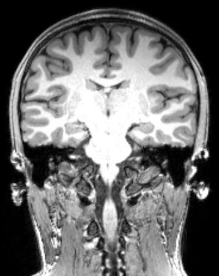
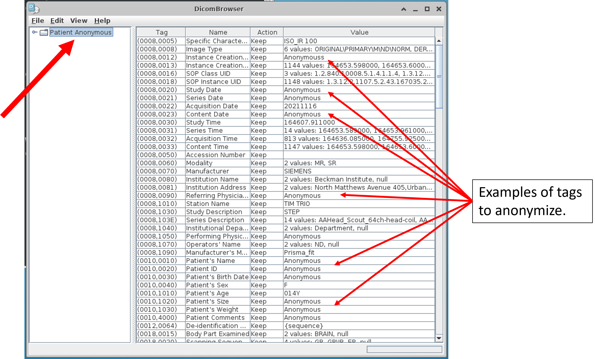

# DICOM Anonymization
Removing identifiable information from the DICOM headers. 

## Background Information
Neuroimaging data is typically stored in a file format called DICOM (.dcm) when it is first collected. These follow the [DICOM](https://www.dicomstandard.org) (Digital Imaging and COmmunications in Medice) standard. This is an international formatting standard for medical images. The first part of DICOM files contain a 'header', which contains a variety of metadata about the image, including scan parameters used to acquire the image, information about how the data maps onto real-world-space, and demographic information about the participant [[1]](#1). The second part of the file contains the pixel/voxel intensity information that make up the image.

DICOM header information organizes information by "tags" which are unique numeric identifiers for each piece of information stored. Each piece of information has a four digit "Data Element Number". Similar information is grouped together under a four digit "Group Number". The combined eight-digit number typically displayed in parenthesis, (Group Number followed by Data Element Number), is the "Data Element Tag" that uniquely identifies each piece of information in the header [[2]](#2).

Many tags have, according to the DICOM standard, been reserved for storing specific information. For example, the Data Element Tag (0010, 0010) is called Patient's Name and tag (0008 1030) is called Study Description [[2]](#2). Similar information is often grouped under the same Group Number. For example, Group Number 0010 often contains patient information while Group Number 0008 often contains information about the study, however this is not enforced by the standard [[3]](#3).

[http://dicomlookup.com/](http://dicomlookup.com/) is a useful resource which can help provide more information about individual tags .

While some information is crucial to correctly display the image and should almost never be edited, other data elements constitute identifiable information that must be removed prior to publicly sharing data. What counts as identifiable data is constantly evolving as researchers discover new ways to identify individuals with the right pieces of information. For example, 87% of the people in the United States may be identifiable by only their gender, birthdate, and the zip code where they live [[4]](#4). To make matters more confusing, regulatory bodies may use differing criteria. We encourage users of this guide to consult with their supervising ethics boards to ensure compliance in removing all potentially identifiable data.

In the instructions provided below, we provide a list of tags you may want to anonymize. This was based on data collected on MRI machines at the Beckman Institute for Advanced Science and Technology. Your data may differ in terms of what is stored in the DICOM headers, and you should always thoroughly review the header contents in at least one participant prior to deciding your own anonymization list.

## Software Setup
### *Preliminary Note*
The software setup sections you will encounter throughout this tutorial do not intend to reinvent the wheel and will largely defer to source documentation for installation details. The intent rather is to describe the tools needed for each step (and where to find them).

### Choosing an operating system
Examples used in this tutorial were generated using the Ubuntu 20.04 operating system. We make no specific recommendations regarding computer setup, however keep in mind that some neuroimaging tools (like [FSL](https://fsl.fmrib.ox.ac.uk/fsl/fslwiki/FslInstallation)) do not run natively on Windows and require additional setup. Command line instructions are specific to the Bash terminal, which is part of the default Ubuntu installation.

### DicomBrowser
To anonymize multiple DICOM files at once, we use the DicomBrowser tool ([https://download.xnat.org/dicombrowser/](https://download.xnat.org/dicombrowser/)).

The software can be downloaded as a .deb file which can be installed on the command line with:
```shell
sudo apt install /path/to/filename.deb
```
Replacing the path with the path and filename of the deb file you downloaded. After that, you should be able to open the browser by typing `DicomBrowser` in the terminal.

Although it is possible to use the browser to create scripts to anonymize all dicoms at once, here we describe the interactive method of anonymization.

## Instructions
The following instructions assume the data you have collected (which we will refer to as source data) are grouped by participants with dicoms for individual scans grouped into sub-folders. Subjects may or may not be grouped into further hierarchies such as session, scan site, or cohort as appropriate. So your source data should look something like the following:

```
    sourcedata
        |-------- session_1
                    |-------- subject_1
                    |               |-------- scan_1
                    |               |-------- scan_2
                    |               |-------- scan_3
                    |
                    |-------- subject_2
                    .               |-------- scan_1
                    .               |-------- scan_2
                    .               |-------- scan_3
                
```

### Anonymizing
1. To start, create a file called AnonDcm in the same directory that your source folder lives in. In the AnonDcm folder, create any subfolders that further organize the subject folders such as session or site.

2. Copy the subject level folder and its contents to the corresponding place in the AnonDcm folder.
   + We recommend copying rather than anonymizing the data in place because if you make a mistake, it's easy to start over.
   
3. Open DicomBrowser by typing `DicomBrowser` in the terminal.

4. In the top menu bar, click on '*File*' >> '*Open*', navigate to the folder you intend to anonymize. You can select the entire participant folder and DicomBrowser with search through all subfolders, loading any DICOM files it finds. This allows you to anonymize data for all of a participant's scans at once. 
   + Depending on the amount of data and computational resources available, this may cause DicomBrowser to hang. If you find this, try loading fewer DICOMs at once, such as going by individual runs.
   
5. In the left pane, click on the folder that says 'Patient \<ID>'. 
   + This will select all DICOM files that were found with that value in the Patient ID (0010, 0020) tag. If multiple Patient IDs were found (such as if you were anonymizing multiple subjects at once), then they would appear as separate folders in the left panel.

<p align="center" width="100%">
    
</p>

6. Verify that the 'Patient \<ID>' listed in the left pane has the same ID as the subject folder you opened.
   + It's not unheard of for DICOMs to accidentally get saved into the wrong subject folder when collecting data. This is a really simple step to make sure that didn't happen.
   
7. For each tag/name listed below, click on the value field. This will display a cursor to allow you to type. Alter the value to "Anonymous". (You will notice that this automatically changes the action field to "Assign".)
   + **(0008, 0012)** Instance Creation Date
   + **(0008, 0020)** Study Date
   + **(0008, 0021)** Series Date
   + **(0008, 0023)** Content Date
   + **(0008, 0090)** Referring Physician Name
   + **(0008, 1050)** Performing Physician Name
   + **(0010, 0010)** Patient Name
   + **(0010, 0020)** Patient ID
   + **(0010, 0030)** Patient Birth Date
   + **(0010, 1020)** Patient Size
   + **(0010, 1030)** Patient Weight
   + **(0010, 4000)** Patient Comments
   + **(0029, 1009)** Private
   + **(0029, 1019)** Private
   + **(0029, 1109)** Private
   + **(0029, 1119)** Private
   + **(0040,0244)** Performed Procedure Step Start Date
   + **(0040,0253)** Performed Procedure Step ID

8. Double check that all of the above fields are now "Anonymous" (and no nearby fields were accidently changed).

9. Click on the value field for **(0008, 0022)** "Acquisition Date". Change this to today's date YYYYMMDD.
   + Note that this date format (year, month, day) is preferred because it is compliant with the ISO 8601 international standard for communication of dates. [[5]](#5)[[6]](#6).

10. In the top menu bar, click on '*File*' >> '*Save...*'. This will pop up a new window with options for saving. Open the topmost drop-down menu and select '*Overwrite existing files*'. 
    + If anonymizing multiple subjects at once, make sure that '*Write all loaded files*' is selected in the bottom drop down menu. If only working with one participant, then the default '*Write only selected files*' should work fine.
    + The reason why we advise overwriting existing files is because the default behavior of appending '-anon' to the file name is not part of the BIDs standard and later conversions steps do not know how to properly handle this extra string. 

11. Click save, update your study documentation [(see below)](#documentation), and you're done!


### Quality Control 
1. Open DicomBrowser by typing `DicomBrowser` in the terminal.

2. In the top menu bar, click on '*File*' >> '*Open*', navigate to the folder you intend check. Single click the folder so that it is highlighted in blue (not navigating inside it) and select '*Open*'.

3. Check all fields listed in step number 7 of [Anonymizing](#anonymizing) to check that they have been changed to "Anonymous". Check that the tag **(0008, 0022)** "Acquisition Date" now has a recent date in its value field.
   + Also make sure there are no typos in the anonymized fields and capitalization is consistent.

4. While checking the fields meant to be anonymized, be sure to check that no additional fields have been changed to "Anonymous".

5. Once you have checked the file, **DO NOT SAVE**. If everything looks correct, update the study documentation [(see below)](#documentation) and repeat move on to the next files. If there is any issue, make note in the study documentation and let anonymizing team members know.


## Documentation
Here we introduce the documentation system we have found useful for tracking the status of each participant's scans. Proper documentation is crucial component of the pipeline and in this folder, you will find a file called [STUDYNAME_dataprocessing.xlsx](./STUDYNAME_dataprocessing.xlsx) that provides a template with some made up data included for illustration. We will refer to this document throughout this tutorial.

<p align="center" width="100%">
    
</p>

Here we have a few example participants undergoing DICOM anonymization. Observe that,

+ Participants are entered according to the data they were scanned and a study identifier. The study identifier is particularly useful for keeping track of multi-session scanning. 
+ Importantly, you will see there is also a place for scan notes. We encourage you to enter brief summaries of information acquired during data collection that may impact analysis decisions. If it is clear from the scan notes that data may be problematic, **do not** just say *excluding*! Instead, write down why this data should not or could not be used. Your future self will thank you. :smiley:
+ The list of IDs are the IDs that you will use in the final BIDS-ified data set. If this does not necessarily need to be the same as the identifiers used when collecting data. If you scroll right in the document, you will find a column at the very end where you can track original IDs.
+ Remember that some of the information you may consider entering (in particular the scan notes and original IDs) may be considered identifiable. *Always carefully review this information before deciding to share publicly.*

DICOM Anonymization occurs in two steps, the anonymization step and the quality control step (see [Instructions](##instructions)). To use this documentation,

1. The person conducting the anonymization should put their initials in the "DICOMS Anonymized column" only for the participants their currently working on. 
2. Once anonymization is complete for a participant, the entry background color should be changed to green to indicate that the data is ready for review.
3. The quality control reviewer should similarly mark their initials in the "DICOM anonymization check" only for participants they are actively reviewing.
4. Tags with any problems should be noted here next to the reviewers initials with a brief explanation of what the problem is. This allows the people doing the anonymization to review and fix these.
5. Once it's been verified that the anonymization was successful and any problems addressed, the "DICOM anonymization check" background color can be changed to green to indicate that the data is ready for the next processing step.

## Further Reading
<a id="1">[1]</a>
Varma, D. R. (2012). Managing DICOM images: Tips and tricks for the radiologist. *The Indian journal of radiology & imaging*, 22(1), 4.

<a id="2">[2]</a>
National Electrical Manufacturers Association (2021) (tech.). *DICOM - Data Dictionary* (Vol. PS3.6, Ser. The DICOM Standard)

<a id="3">[3]</a>
National Electrical Manufacturers Association (2021) (tech.). *DICOM - Message Exchange* (Vol. PS3.7, Ser. The DICOM Standard)

<a id="4">[4]</a>
Sweeney, L. (2000). Simple demographics often identify people uniquely. *Health (San Fransisco)*, *671*(2000), 1-34.

<a id="5">[5]</a>
International Organization for Standardization. (2019, February 25). ISO 8601-1:2019. ISO. Retrieved November 22, 2021, from https://www.iso.org/standard/70907.html.

<a id="6">[6]</a>
Wikimedia Foundation. (2021, November 20). *ISO 8601*. Wikipedia. Retrieved November 22, 2021, from https://en.wikipedia.org/wiki/ISO_8601.