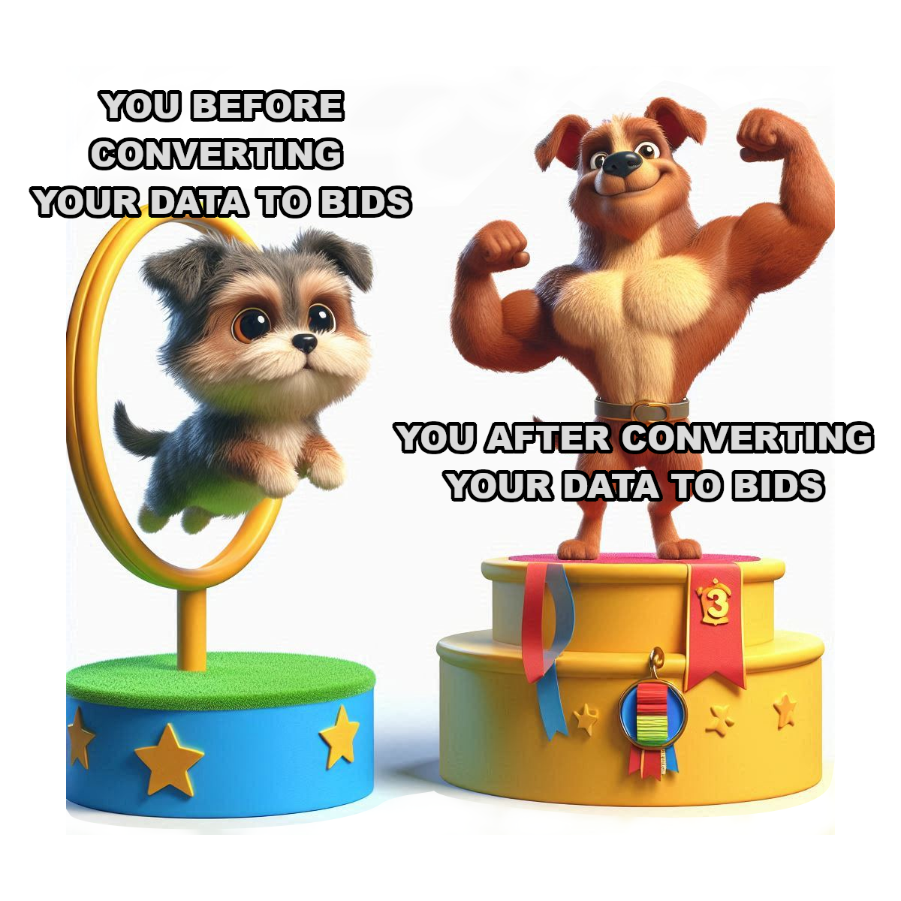

# Convert-2-BIDS

**A step-by-step workflow for converting raw imaging data into anonymized, preprocessed, BIDs-compliant data sets ready for sharing on [OpenNeuro](https://openneuro.org/).**

## Why this Exists

The intent of this resource is to compile current tools and knowledge on best practices converting raw neuroimaging data into high quality, maintainable, and shareable data sets. Our goal is to lower the barrier to good data keeping practices and increase the number of openly available data sets.

We provide step-by-step instructions and make minimal assumptions about prior knowledge working with imaging data and the associated tools. Where possible, we provide rationales for decisions in this workflow and explanations of the tools and processes employed.

{: .important }
We recognize that there are many good pipelines currently in development that automate many of the steps described here. Although useful, the intent of this resource is take users through each individual step with as much explanation as possible, so that they can skillfully utilize more automated tools and recognize and respond appropriately when workflows fail.

If you find this work useful, find any errors, or discover outdated information, please consider lending your time and knowledge to creating a more robust resource for the neuroimaging community.

***Currently this documentation outlines how to prepare a dataset consisting of one or more functional MRI runs, at least one high resolution structural image, and optional field maps.***

If we receive feedback that this documentation is helpful, we may add further documentation for preparing other types of scan data. [So let us know what you think!](https://github.com/heuristicwondering/convert2BIDS-fMRI/discussions)

# Getting Started
Convert2BIDs is divided into **three** major steps. Each of these can be executed independently of each other but often make critical assumptions about the format of the data based on execution of previous steps. It's highly recommended following steps in the order provided. 

Simply click on each button to be taken to the relevant instruction page.

| [STEP 1](/docs/BIDS/){: .btn .btn-purple} | Anonymization, conversion from Dicom to Nifti file formats, and conversion to a BIDs file structure. |

| [STEP 2](/docs/BIDS/){: .btn .btn-blue} | Preproccessing |

| [STEP 3](/docs/BIDS/) | Additional quality control and documentation for future analysis |
